# hotel-reservation-program


<div align="center">


[](https://github.com/java-3rd-team-project/hotel-reservation-program)

</div>


## Hotel Reservation Program v1.0

> 중앙정보처리학원 데이터융합 자바(JAVA) 응용 SW개발자 취업과정 4조<br>
> 객체지향 설계에 대한 이해<br>
> 개발기간 : 2023.4.10 ~ 2023.4.16


## 개발팀 소개

- 이진호
  - [깃허브](https://github.com/jhlee9462)
  - PM
  - 예약 로직 구현
- 한세진
  - [깃허브](https://github.com/Esther2112)
  - 예약 수정, 삭제 구현
  - 고객정보 수정 구현
- 조성훈
  - [깃허브](https://github.com/nuhgnoesoj)
  -

## 프로젝트 소개
> 객체지향 설계 원칙인 SOLID 를 공부하기 위한 JAVA 프로그램입니다.<br>
> 호텔리어의 업무에 사용하는 프로그램으로 신규 예약, 수정, 삭제 및 게시판 기능이 있습니다.

## 기술 스택
### 환경
<div>


</div>

### 개발
<div>

</div>

## 화면 구성

### 메인 화면
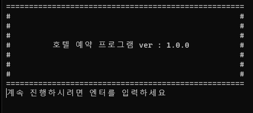

#### 메뉴 선택 화면
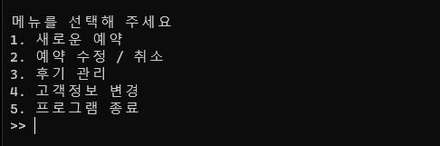

### 1. 예약하기
##### 1-1. 회원 데이터에 존재하지 않는 경우 회원가입 진행
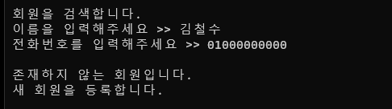

##### 1-2. 회원 데이터가 존재하는 경우 예약 진행


#### 숙박 일자 및 잔여 객실 수량 확인 화면
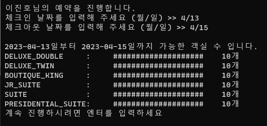

#### 객실 사이즈 선택


#### 입력된 예약정보 확인 화면
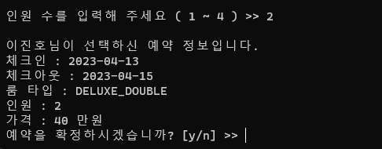

#### 예약 확정시 출력 화면
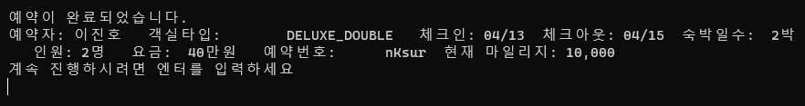

### 2. 예약 수정하기
#### 예약 수정 또는 취소
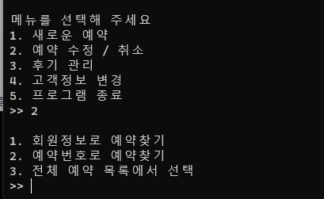

#### 예약리스트 출력
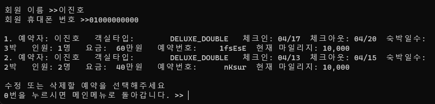

#### 예약 수정 선택시 재예약 진행
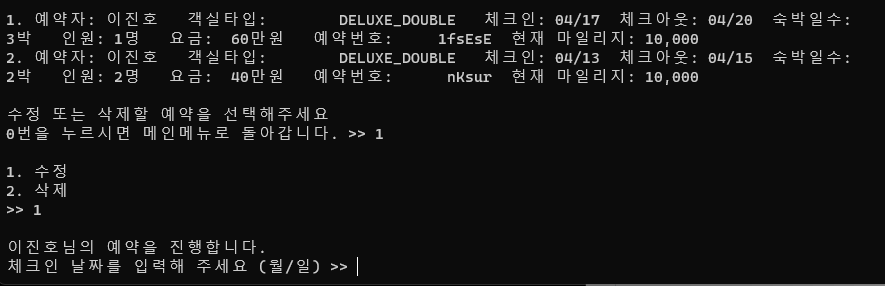

### 3. 후기 관리
#### 후기 게시판 


#### 게시글 상세 보기
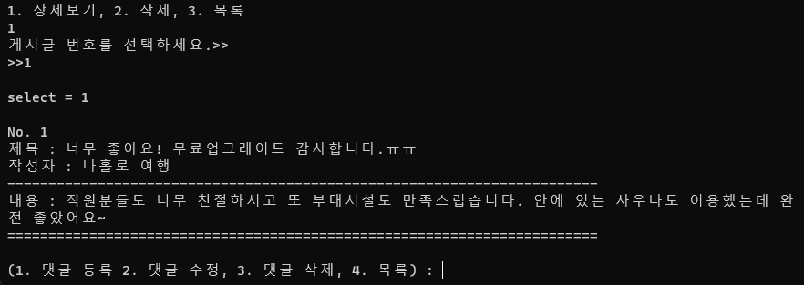

#### 댓글 달기 선택
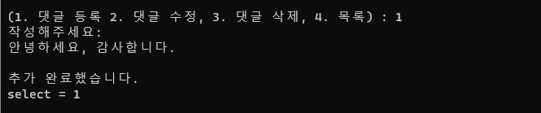

#### 댓글 추가된 화면
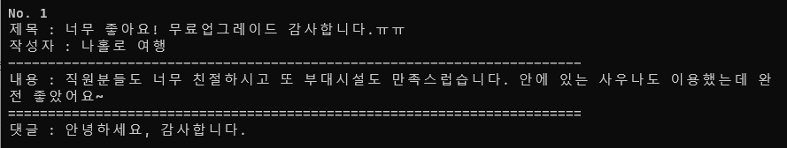

#### 댓글 수정 선택
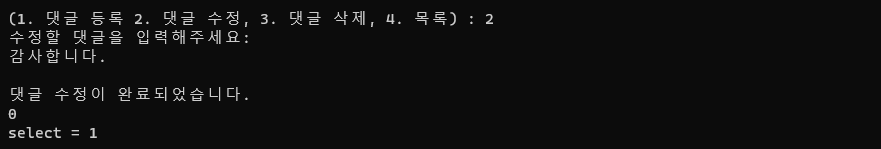

#### 댓글 수정 완료 화면
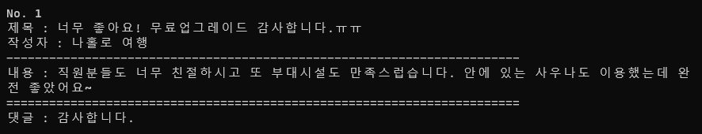

#### 댓글 삭제
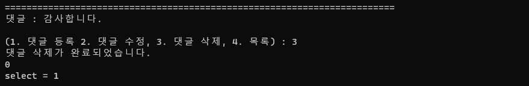

### 4. 고객 정보 변경
#### 고객 정보 수정
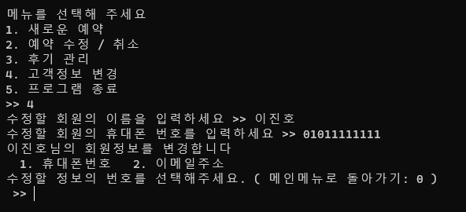

#### 고객정보 수정 후 화면
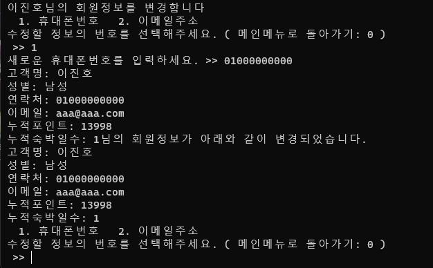

## 주요 기능

- 호텔 예약
- 예약 조회
- 예약 수정 및 삭제
- 리뷰 관리

## 아키텍쳐

### Flow Chart


### ERD


### Directory

```
.
├── README.md
├── ReadmeHistory.md
├── flow chart
│   ├── 순서도 이미지.png
│   └── 클래스 다이어그램.png
├── java
│   ├── java.iml
│   └── src
│       ├── AvailableDate.java
│       ├── BoardViewer.java
│       ├── Controller.java
│       ├── Gender.java
│       ├── META-INF
│       │   └── MANIFEST.MF
│       ├── Main.java
│       ├── Member.java
│       ├── Rate.java
│       ├── Reservation.java
│       ├── Review.java
│       ├── ReviewService.java
│       ├── RoomSize.java
│       ├── Viewer.java
│       ├── common
│       │   └── Utility.java
│       └── sav
│           ├── availableDate.sav
│           ├── member.sav
│           ├── reservation.sav
│           └── review.sav
├── logo.png
├── out
│   ├── artifacts
│   │   └── hotel_reservation_program_jar
│   │       └── hotel-reservation-program.jar
│   └── production
│       └── java
│           ├── AvailableDate.class
│           ├── BoardViewer$1.class
│           ├── BoardViewer.class
│           ├── Controller.class
│           ├── Gender.class
│           ├── META-INF
│           │   └── MANIFEST.MF
│           ├── Main.class
│           ├── Member.class
│           ├── Rate.class
│           ├── Reservation$1.class
│           ├── Reservation.class
│           ├── Review.class
│           ├── ReviewService.class
│           ├── RoomSize.class
│           ├── Viewer.class
│           ├── common
│           │   └── Utility.class
│           └── sav
│               ├── availableDate.sav
│               ├── member.sav
│               ├── reservation.sav
│               └── review.sav
└── reservation.exe
```